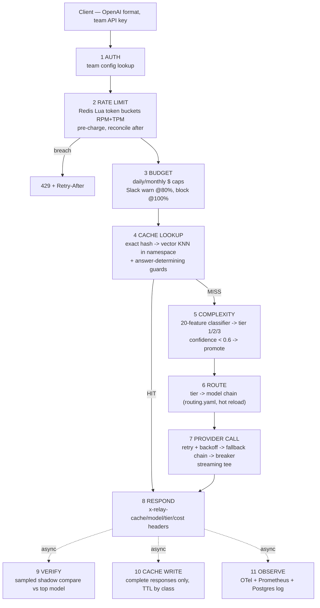

# Relay — Cost-Optimizing LLM Gateway with Semantic Caching

[](https://github.com/Nishant2306/relay/actions/workflows/ci.yml)
[-blue)](datasets/TIERING_RUBRIC.md)

**One-liner:** an OpenAI-compatible gateway — change one base URL — that enforces
per-team rate limits and dollar budgets, answers repeated and *paraphrased*
requests instantly from a semantic cache that refuses lookalike traps, routes
each miss to the cheapest model that can handle it (with an async LLM-judge
watching for routing mistakes), and survives provider outages with retries,
fallback chains, and circuit breakers — all observable in Prometheus/Grafana.

Companion project: **[Argus](https://github.com/Nishant2306/argus)** — the
evaluation/observability platform. Relay is the *serving* layer (what did it
cost, did it stay up); Argus is the *quality* layer (was the output good).

---

## The request pipeline



---

## Measured results

Numbers produced by `make harvest` (`scripts/harvest_metrics.py`); cache
correctness by `scripts/eval_cache_traps.py`. Workload is **simulated**
against the chaos mock provider with realistic simulated pricing (see Known
gaps).

| Metric | Result | Protocol |
|---|---|---|
| Semantic-cache paraphrase hit rate | **95.0%** | 80 held-out human-adjudicated pairs; threshold + guards tuned on the 40 dev pairs only (ADR-0009) |
| Trap false-hit rate (offline) | **2.5%** (1/40) | same held-out split — honest and non-zero; the survivor is a multi-token entity swap (`AWS`→`Google Cloud`) |
| Trap replay against the live gateway | hit 95.0% (38/40), false-hit 5.0% (2/40) | production routing active; adds one cross-pair KNN collision to the offline survivor |
| Steady load (50% unique / 30% repeat / 20% paraphrase) | **~40 RPS, zero failures, 82.9% hit rate** (2,513 exact / 2,403 semantic) | 120 s Locust run vs the chaos mock |
| Repeat-heavy convergence | hit rate converges to **96%** | 25-prompt hot set, 90 s |
| Classifier accuracy | **61.9%** vs **46.0%** length-only control (+15.9 pp) | group-aware frozen split, test fold evaluated once; all confusions adjacent-tier, zero 1↔3 |
| Gateway overhead under load | **p50 3.6 ms / p95 9.8 ms / p99 29.6 ms** (target p50 < 10 ms) | Prometheus histogram across the load scenarios; exact hits serve end-to-end in ~4 ms |
| Rate-limit storm | 1,618 clean 429s, **100% with Retry-After**; innocent team on the same gateway: **zero 429s** | one team at 5× its 60 RPM limit |
| Rate-limit correctness | 120-burst at 60 RPM → ~60 accepted; 50 parallel clients, zero over-admission | property test vs real Redis (testcontainers) |
| Budget exhaustion | 274 requests served → cap hit → 526 clean `budget_exhausted` blocks | $0.25 daily cap, cache disabled, Slack warn at 80% |
| Outage drill | 12,838 requests, **zero client-visible errors** through a verified 3-minute primary kill; **669 served via fallback**; breakers open in <2 s, probe every 30 s, auto-close on recovery | `make drill` — cold cache, provider `/health` asserted down during the window |
| Singleflight | 10 concurrent identical misses → **1 upstream call** | integration test vs real Redis |
| Savings vs flagship | **91.0%** across 67k logged requests (87.7% cumulative hit rate), attributed separately: **$50.17 cache / $1.86 down-routing** (ADR-0008, never blended) | counterfactual = every request priced at gpt-4o rates; simulated workload |


*Business dashboard under `make loadtest`. The savings panel keeps cache and
routing separate on purpose (ADR-0008) — cache does the heavy lifting because
it absorbs traffic before the router ever sees it.*

### The finding worth reading twice

Cosine similarity **cannot** power a safe semantic cache by itself. On the
frozen corpus, hit and miss pairs are statistically indistinguishable
(held-out medians 0.911 vs 0.913); adversarial lookalikes like
*"Convert 20 Celsius to Fahrenheit" / "Convert 20 Fahrenheit to Celsius"*
embed at **0.995**. Relay therefore validates every KNN candidate with
deterministic **answer-determining guards** — numbers, negation,
inverse-operation pairs, directional swaps, single-word content substitutions
(ADR-0010). Guard families that did the work on the held-out traps:

| Guard | Held-out trap pairs rejected |
|---|---|
| content substitution (`Paris`→`London`, `GET`→`POST`) | 16 |
| number mismatch | 11 |
| inverse pairs (`min`/`max`, `sum`/`average`…) | 6 |
| direction swap (`X to Y` vs `Y to X`) | 3 |
| negation mismatch | 2 |
| boolean operator swap (`AND`/`OR`) | 1 |

The flagged `known_hard_embedding_case` pair (`safe`/`unsafe`, similarity
0.986) is caught by the substitution guard.

## Known gaps

- **Simulated traffic.** All load numbers come from the chaos mock provider
  with simulated pricing. Real-provider latency variance and pricing drift
  are not represented. The demo path works against Ollama/OpenAI/Anthropic
  adapters, but no headline number was measured there.
- **Multi-token entity swaps beat the guards** (`AWS`→`Google Cloud`): the
  1/40 offline held-out false hit. A named-entity comparison layer is the v2
  answer. Live replay adds a second failure mode: **cross-pair KNN
  collisions** — guards check only the top-1 neighbor, so a query can match a
  *different* cached prompt that happens to pass the guards (2/40 = 5% live).
- **Guards are English-centric** regex/lexicon logic.
- **Single Redis is a SPOF** — buckets, cache, vector index, locks, and the
  verify queue all live in one instance. Hardening path: Redis Cluster or
  per-concern instances; buckets fail-open vs cache fail-closed policy split.
- **Classifier at 61.9%** — well above the 46.0% control, but the group-aware
  split (whole template families held out) makes this an honest
  generalization number, not a headline one. All errors are adjacent-tier;
  the fail-safe promotion + verification loop absorb under-routing.
- **API-key auth only**; JWT/OIDC is v2 scope.

## The datasets are first-class artifacts

Frozen at `relay-datasets-v1.1.0`; CI rejects any change without a version bump.

- `datasets/cache_traps.jsonl` — 120 pairs (60 paraphrase-hit / 60 trap-miss),
  every one human-adjudicated, with phenomenon labels
  (`negation_flip`, `source_target_swap`, `aggregation_swap`, …) and an
  embedded 40-dev/80-test split honored by every script in this repo.
- `datasets/complexity_labels.jsonl` — 600 prompts, tiers 205/196/199, all
  human-verified with 34 logged bootstrap corrections, group-aware split
  (`split_group`), length-confound strata, and per-prompt `cache_class`.
- `datasets/TIERING_RUBRIC.md` — the labeling/split/eval contract. The
  **length-only control** (45.3% logreg / 46.0% tree, reproduced exactly by
  `scripts/length_baseline.py`) is a CI release gate: if character count
  alone ever predicts tier at ≥50%, the build fails.

## Design decisions (ADRs)

| | |
|---|---|
| [0001](docs/adr/0001-local-embeddings.md) | Local embeddings (bge-small, CPU) — consistency over SOTA |
| [0002](docs/adr/0002-cache-namespacing.md) | Namespacing: system prompt × model × params × team, enforced in the index |
| [0003](docs/adr/0003-exact-hash-fast-path.md) | Exact-hash fast path before vector search |
| [0004](docs/adr/0004-singleflight.md) | Singleflight stampede protection (per exact key) |
| [0005](docs/adr/0005-tpm-precharge.md) | TPM pre-charge + reconcile |
| [0006](docs/adr/0006-cache-write-policy.md) | Cache only complete, successful, cacheable responses |
| [0007](docs/adr/0007-fallback-never-downgrades.md) | Fallback never downgrades quality |
| [0008](docs/adr/0008-honest-savings.md) | Honest savings accounting with attribution |
| [0009](docs/adr/0009-dev-test-discipline.md) | Dev/test discipline on the trap corpus |
| [0010](docs/adr/0010-answer-determining-guards.md) | Answer-determining guards — the corpus forced it |

## vs LiteLLM / Portkey / Helicone / GPTCache / OpenRouter / Cloudflare AI Gateway

I studied these and built the core myself to own the hard parts — atomic
distributed rate limiting, cache correctness under similarity matching,
streaming tee, breaker state machines — and to integrate caching + routing +
budgets natively instead of chaining three tools.

| Capability | Relay | LiteLLM | Portkey | GPTCache | Helicone |
|---|---|---|---|---|---|
| OpenAI-compatible proxy | ✅ | ✅ | ✅ | — | ✅ |
| Semantic cache | ✅ guarded + namespaced | simple | ✅ | ✅ unguarded | ✅ basic |
| Measured false-hit rate on an adversarial corpus | **✅ 2.5%** | — | — | — | — |
| Complexity-based routing + verification loop | ✅ | manual rules | ✅ configs | — | — |
| Atomic RPM+TPM buckets w/ pre-charge | ✅ Lua | ✅ | ✅ | — | — |
| Budgets w/ warn/block + attribution split | ✅ | ✅ | ✅ | — | ✅ |
| Breakers/fallback with zero-drop drill | ✅ | partial | ✅ | — | — |

When a team should just adopt LiteLLM: they need 100+ providers,
battle-tested edge cases, and a plugin ecosystem more than they need
cache-correctness guarantees or integrated routing economics.

## Run it yourself

```bash
git clone https://github.com/Nishant2306/relay && cd relay
make install   # .venv + package + dev extras

make up        # gateway + 2 chaos mocks + Redis 8 + Postgres + Prometheus + Grafana
make seed      # demo teams (demo / loadtest / stormy / spendy)
make train     # complexity classifier vs the 46.0% control (reloads the gateway)
make test      # unit + dataset contracts (no Docker needed)
make loadtest  # steady/repeats/storm/budget scenarios + held-out trap replay
make drill     # 3-minute provider outage — watch Grafana, expect zero 5xx
make harvest   # print every number above from live telemetry
```

`make up` blocks until the gateway is healthy (Alembic done), so `seed`
straight after is safe. `make train` restarts the gateway because the
classifier is loaded once at startup.

Point any OpenAI client at it:

```python
from openai import OpenAI
client = OpenAI(base_url="http://localhost:8080/v1", api_key="relay-demo-key")
client.chat.completions.create(
    model="relay-auto",  # or any provider/model, e.g. "mock/cheap-a"
    messages=[{"role": "user", "content": "What is Python?"}],
)
```

Grafana at `:3000` (anonymous admin, three provisioned dashboards),
Prometheus at `:9090`, admin API at `/admin/*` (`x-admin-key`), Streamlit
savings page via `streamlit run admin/status_page.py`.

Local ports note: Postgres maps to **5433** and the mock providers to
**8200/8201** to coexist with Argus on the same machine.

## v2 roadmap (deliberately not built)

Go rewrite, priority queues for tiered limits, learned/adaptive cache
thresholds, NER-based entity guards, per-team system-prompt injection,
multi-region, JWT/OIDC.
